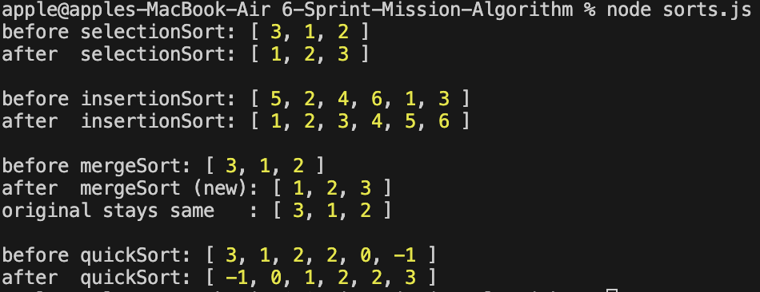

# 미션목표

- 자바스크립트로 정렬 알고리즘 구현하기

## 요구사항

다음 정렬 알고리즘을 각각 JavaScript 함수로 구현해 주세요.

선택 정렬 (Selection sort)

- [x] 숫자형 배열을 파라미터로 받고, 해당 배열을 수정하도록 구현합니다.

삽입 정렬 (Insertion sort)

- [x] 숫자형 배열을 파라미터로 받고, 해당 배열을 수정하도록 구현합니다.

병합 정렬 (Merge sort)

- [x] 숫자형 배열을 파라미터로 받고, 정렬된 새로운 배열을 리턴하도록 구현합니다.

퀵 정렬 (Quick sort)

- [x] 숫자형 배열을 파라미터로 받고, 해당 배열을 수정하도록 구현합니다.

## 주요 변경사항

-
-

## 스크린샷

- 

## 멘토에게

- 셀프 코드 리뷰를 통해 질문 이어가겠습니다.
