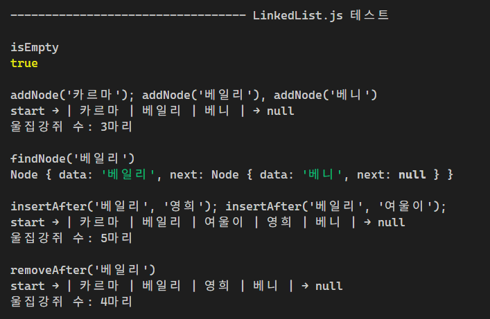
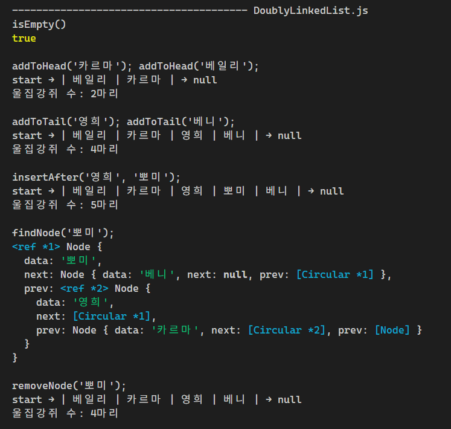
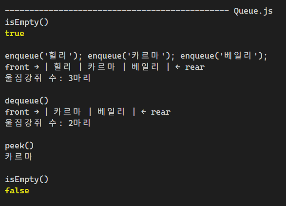
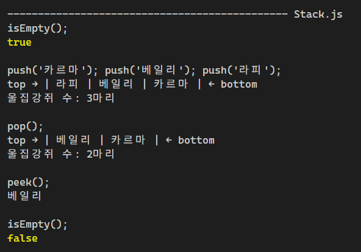
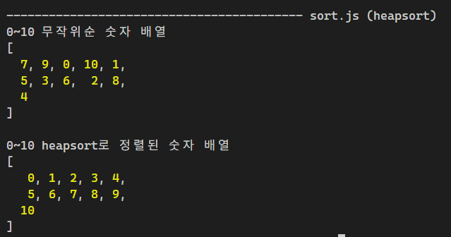

## 미션13 목표

- 자바스크립트로 자료 구조 구현하기
- 자바스크립트로 힙 정렬 구현하기

### 요구사항

- 링크드 리스트 (Linked List)
  - [x] 파일 이름: LinkedList.js
  - [x] 클래스 이름: LinkedList
  - [x] 메소드 addNode(value): 리스트 끝에 새 노드 추가
  - [x] 메소드 findNode(value): 주어진 값을 가지는 노드를 찾아 리턴
  - [x] 메소드 insertAfter(targetValue, newValue): 특정 값을 가진 노드 뒤에 새 노드 추가
  - [x] 메소드 removeAfter(targetValue): 특정 값을 가진 노드 뒤의 노드 삭제

- 이중 링크드 리스트 (Doubly Linked List)
  - [x] 파일 이름: DoublyLinkedList.js
  - [x] 클래스 이름: DoublyLinkedList
  - [x] 메소드 addToHead(value): 리스트 앞쪽에 노드 추가
  - [x] 메소드 addToTail(value): 리스트 뒤쪽에 노드 추가
  - [x] 메소드 insertAfter(targetValue, newValue): 특정 값을 가진 노드 뒤에 새 노드 추가
  - [x] 메소드 findNode(value): 특정 값을 가진 노드를 찾아 반환
  - [x] 메소드 removeNode(value): 특정 값을 가진 노드 삭제

- 큐 (Queue)
  - [x] 파일 이름: Queue.js
  - [x] 클래스 이름: Queue
  - [x] 메소드 enqueue(value): 큐 맨 뒤에 값을 추가
  - [x] 메소드 dequeue(value): 큐의 앞에서 값을 제거하고 그 값을 리턴
  - [x] 메소드 peek(): 큐의 앞에 있는 값을 제거하지 않고 리턴
  - [x] 메소드 isEmpty(): 큐가 비어 있는지 불린형으로 리턴

- 스택 (Stack)
  - [x] 파일 이름: Stack.js
  - [x] 클래스 이름: Stack
  - [x] 메소드 push(value): 스택의 맨 위에 값을 추가
  - [x] 메소드 pop(): 스택의 맨 위 값을 제거하고 그 값을 리턴
  - [x] 메소드 peek(): 스텍의 맨 위 값을 제거하지 않고 그 값을 리턴
  - [x] 메소드 isEmpty(): 스택이 비어 있는지 불린형으로 리턴

- 이진탐색트리 (Binary Search Tree)
  - [x] 파일 이름: BinarySearchTree.js
  - [x] 클래스 이름: BinarySearchTree
  - [x] 메소드 insert(value): 트리에 값 추가
  - [x] 메소드 find(value): 주어진 값을 찾고 해당 노드를 리턴
  - [x] 메소드 remove(value): 트리에서 해당 값을 삭제

- 힙 정렬 (Heap Sort)
  - [x] 파일 이름: sorts.js
  - [x] 함수 이름: heapsort
  - [x] 기능: 숫자형 배열을 받아서 받은 배열을 정렬된 상태로 수정

### 추가 구현

- [x] 메소드 getSize 구현
- [x] uniqueRandom util 함수 구현

## 스크린샷

## 멘토에게

- 셀프 코드 리뷰를 통해 질문 이어가겠습니다.
